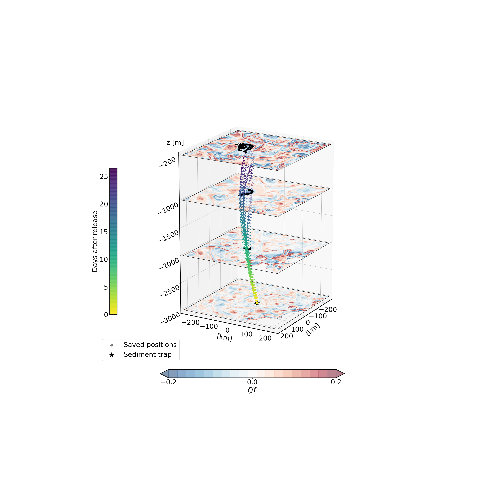

# SPARO

SPARO stands for Sediment traps PARticule Origin. This is a Convolutional Neural Network (CNN) predicting the catchment area of particles caught by deep sediment traps.

# Publication

# Code

# Licence 
